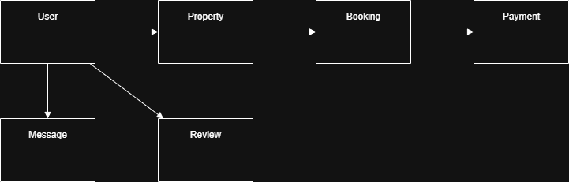

# Airbnb Database - Entity Relationship Diagram

## Objective
This ERD models the structure of an Airbnb-like system, defining how users, properties, bookings, payments, reviews, and messages relate.

## Entities
- **User**
- **Property**
- **Booking**
- **Payment**
- **Review**
- **Message**

## Key Relationships
- Users can own multiple properties (host).
- Users can book properties (guest).
- Each booking can have one payment.
- Users can review properties they’ve booked.
- Users can message each other.

## ERD Diagram

